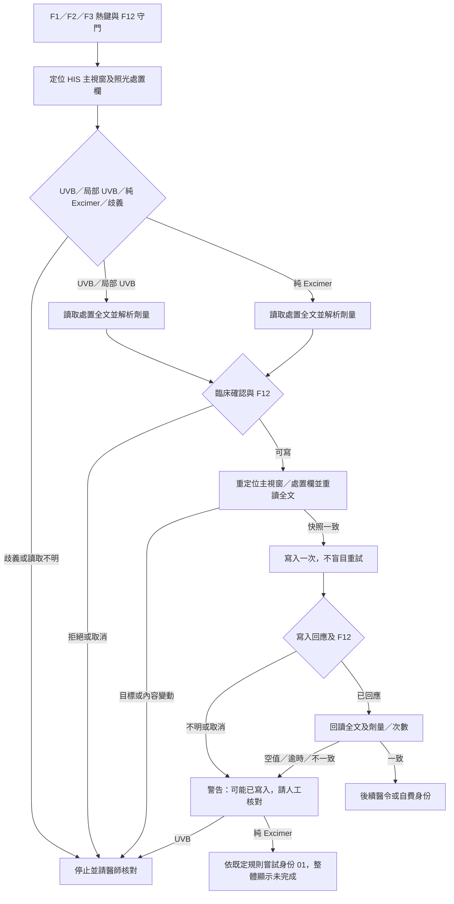

# 第五期：F1–F3 HIS 處置寫入流程與驗收

基準為正式 `main` 的 `7c66bd7aa70d4b0fea50d4aa6f73e3d1cb7564da`。本期只處理可重現的處置寫入狀態問題，使用匿名假 HIS；沒有連線或修改正式病歷。第一至四期已完成的熱鍵註冊、刷新世代、可注入 HIS 介面、排班與會診／打卡邊界均沿用，沒有因 `main.py` 長而重寫整檔。

## 資料流與狀態

| 路徑 | 已驗證成功 | 取消／拒絕 | 寫入或回讀結果不明 |
|---|---|---|---|
| F1 一般／局部 UVB | 既定順序先輸入 51019＋療程 1，再更新處置；確定無 UVB 行時正常結束 | 不再將後段取消當作完整成功，已輸入醫令不自動回退，警告醫師核對 | 回傳未完成，提醒已輸入醫令；不自動重寫或刪醫令 |
| F2／F3 一般／局部 UVB | 先更新並回讀完整處置，再輸入 51019＋療程 2／3 | 停止後續醫令；若寫入後中止，警告可能已有部分結果 | 停止後續醫令，將無法確認的寫入記為 submitted／mismatch，請人工核對 |
| F1 純 Excimer | 保留既定專用醫令 1850159＋療程 1，不自動改身份 | 原有失敗警告及人工處理 | 不套用 F2／F3 身份規則 |
| F2／F3 純 Excimer | 劑量讀回確認後，依既定規則設身份 01，略過 51019／療程 | 間隔過短或 F12 中止不設身份；醫師拒絕劑量確認時仍按既定計費規則處理 | 處置寫入／讀回不明時仍依既定計費規則嘗試身份 01，但整體回報未完成，提示人工核對；身份本身未驗證也不報完成 |

劑量、MAX、間隔、一般與局部 UVB 多行更新及純 Excimer 計費決策均未變更。Excimer 的舊確認流程在按「是」後同時略過陳舊紀錄與上限兩類檢查；這涉及臨床確認次數，本期只記錄為待使用者定案的項目，未暗中修改。

## 已修反例與限制

舊流程在確認視窗停留時若 HIS 處置被改，可能用舊全文覆蓋新內容；現在寫前重定位視窗和欄位並比對全文，不一致就不寫。舊 UVB 回讀只核對劑量行，其他病史行被 HIS 改掉也可能通過；現在核對完整多行內容及原有劑量／次數規則。Excimer 舊流程只看寫入回應，沒有回讀；現在回讀全文，無法確認不顯示整體完成。F12 在阻塞寫入／回讀期間觸發時，後續醫令或身份不繼續，並顯示可能已有部分寫入。寫入回傳失敗或逾時不再宣稱「未更新」，也不自動重試。

完整文字核對允許 HIS 對**被更新的行**調整空白和大小寫，但原本未改的行須逐行一致；HIS 若刻意新增／移除其他行會被判定為需人工核對。寫前快照只核對主視窗、處置欄 handle、類型與全文，無法在假系統證明真 HIS 患者身份或 Delphi 儲存後資料庫狀態；實機須另驗。

`tests/test_main_his_write_transaction_2026_09_25.py` 使用合成 UVB、局部 UVB、Excimer 與非照光病史，涵蓋確認時改文、主視窗／欄位變更、其他行遺失、回讀空值或不符、I/O 逾時、重複觸發、F12 與身份結果。另以既有 F7／F8／F9／F10／F12、HIS 未知版本、F1–F3 劑量規則及醫令守門測試回歸。所有實測指令與結果以正式 CI 記錄為準。

## 合成耗時

`scripts/benchmark_his_memo_flow.py` 讓基準與候選使用各自常駐、已暖機的 Python 行程，交錯執行 20 對匿名 F2 假 HIS；每次讀取人工睡 2 ms、寫入睡 3 ms。測得中位數（括號為最小–最大）：

| 階段 | 基準 ms | 候選 ms |
|---|---:|---:|
| F2 callback 全程 | 8.4927（8.027–8.9398） | 10.8777（10.2284–11.0512） |
| HIS 讀取，含候選寫前快照 | 2.2904（2.1748–2.3949） | 4.6909（4.5813–4.8637） |
| 解析／計算 | 0.1209（0.1052–0.1878） | 0.1121（0.1075–0.1922） |
| 寫入 | 3.3300（3.0292–3.5534） | 3.5050（3.0266–3.6153） |
| 回讀 | 2.5078（2.0304–2.5655） | 2.5031（2.0999–2.5372） |

候選全程約多 2.4 ms，主要是多一次寫前讀取。這是安全檢查的可預期成本，不視為效能改善；假熱鍵 callback 不含真鍵盤鉤子、HIS 網路、Tk 繪製或醫院電腦延遲。20 對樣本不估計實機 p95。

## 診間電腦待驗與回復

在無病人操作的安全時段，由醫師檢查 F7 浮動門診、F8 快速文字、F9／F10 守門及 F12 中止；於可控測試資料確認 F1、F2、F3 的一般 UVB、局部 UVB、純 Excimer、醫令／療程／身份與全文回讀。尤其注意 HIS 因寫入觸發的自動格式化會否使完整文字核對持續報警；未知 HIS 版本仍只通知並保守處理。記錄不含姓名、病歷號或病史全文的版本、步驟和結果，不為量測增加真病歷寫入。

若實機不相容，回退整個已驗證的前版 `7c66bd7aa70d4b0fea50d4aa6f73e3d1cb7564da` 對應發布包與 `manifest.json`，保留設定與資料；不要只複製單一 `main.py`，避免版本與雜湊不一致。對已寫入但無法確認的個案，先人工核對 HIS，勿重按熱鍵當作回退。
