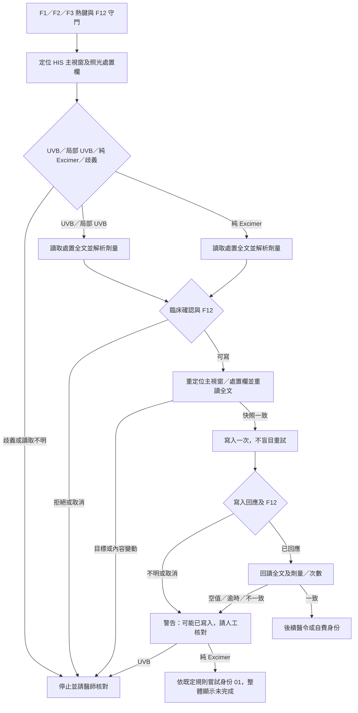

# 第五期：F1–F3 HIS 處置寫入流程與驗收

基準為正式 `main` 的 `7c66bd7aa70d4b0fea50d4aa6f73e3d1cb7564da`。本期只處理可重現的處置寫入狀態問題，使用匿名假 HIS；沒有連線或修改正式病歷。第一至四期已完成的熱鍵註冊、刷新世代、可注入 HIS 介面、排班與會診／打卡邊界均沿用，沒有因 `main.py` 長而重寫整檔。

## 資料流與狀態

| 路徑 | 已驗證成功 | 取消／拒絕 | 寫入或回讀結果不明 |
|---|---|---|---|
| F1 一般／局部 UVB | 確認為一般照光後，依既定順序先輸入 51019＋療程 1，再更新處置；確定無 UVB 行時正常結束 | 分流讀取不明時不輸入任何醫令或療程；後段取消不再當作完整成功，已輸入醫令不自動回退，警告醫師核對 | 已下醫令後才發生的寫入／回讀不明，回傳未完成並提醒醫師核對；不自動重寫或刪醫令 |
| F2／F3 一般／局部 UVB | 先更新並回讀完整處置，再輸入 51019＋療程 2／3 | 停止後續醫令；若寫入後中止，警告可能已有部分結果 | 停止後續醫令，將無法確認的寫入記為 submitted／mismatch，請人工核對 |
| F1 純 Excimer | 保留既定專用醫令 1850159＋療程 1，不自動改身份 | 原有失敗警告及人工處理 | 不套用 F2／F3 身份規則 |
| F2／F3 純 Excimer | 劑量讀回確認後，依既定規則設身份 01，略過 51019／療程 | 間隔過短、F12 中止，或寫前快照已變／讀取失敗時不設身份，明確提醒人工核對；醫師拒絕劑量確認時仍按既定計費規則處理 | 處置已送出但寫入／讀回不明時仍依既定計費規則嘗試身份 01，但整體回報未完成，提示人工核對；身份本身未驗證也不報完成 |

劑量、MAX、間隔、一般與局部 UVB 多行更新未變更。純 Excimer 在處置已送出但寫入／回讀不明時，仍沿用原有嘗試設定身份 01 的規則；**寫前快照已變或無法重新讀取**是新增的例外，計費處理尚待使用者定案。Excimer 的舊確認流程在按「是」後同時略過陳舊紀錄與上限兩類檢查；這涉及臨床確認次數，本期只記錄為待使用者定案的項目，未暗中修改。

| F2／F3 純 Excimer：確認期間 HIS 處置或目標變動 | 實際行為與影響 |
|---|---|
| 原版 | 沒有寫前快照；可能把舊處置全文寫回已變動的目標，隨後設定身份 01。這有覆蓋新病史或錯誤計費目標的風險。 |
| 目前候選版 | 偵測變動或讀取失敗就停止，不送出處置寫入，也不設定身份 01；要求醫師核對。可避免在目標不明時自動更動，但若這次確為自費治療，須由醫師人工補正身份。 |
| 待定案 | 保留目前停止且不設 01，或在停止處置寫入後仍嘗試設 01。後者維持舊計費傾向，但處置／病人目標無法驗證時可能設定到錯誤目標；未取得醫師選擇前，不把任何一種視為正式定案。 |

## 已修反例與限制

舊流程在確認視窗停留時若 HIS 處置被改，可能用舊全文覆蓋新內容；現在寫前重定位視窗和欄位並比對全文，不一致就不寫。舊 UVB 回讀只核對劑量行，其他病史行被 HIS 改掉也可能通過；現在核對完整多行內容及原有劑量／次數規則。Excimer 舊流程只看寫入回應，沒有回讀；現在回讀全文，無法確認不顯示整體完成。F12 在阻塞寫入／回讀期間觸發時，後續醫令或身份不繼續，並顯示可能已有部分寫入。寫入回傳失敗或逾時不再宣稱「未更新」，也不自動重試。

F1 在輸入 51019 之前若有控件類別名稱讀取失敗、列舉失敗、處置欄讀取逾時、主視窗不存在或分流偵測例外，現在會停止並提醒核對；不能將「無法判斷是否為純自費 Excimer」當成一般 UVB。若 F1 前段已輸入 51019，後段卻重新分類成純 Excimer，F12 中止時仍會提醒醫師人工核對：如確認為純自費 Excimer，應處理不相容的 51019 並確認正確的 Excimer 醫令、療程 1、身份及處置；不能將療程 1 一併當成錯誤項目刪除。F12 發生在 UVB 寫入期間或回讀驗證前時，以不含病人識別資訊的 `submitted_unverified` 稽核事件留下可能已寫入的證據。

純 Excimer 的處置文字寫入現在也有獨立的稽核事件：回讀全文確認時記 `ok`，回讀不符記 `mismatch`，寫入或回讀結果不明及 F12 中止記 `submitted_unverified`；身份 01 的既有稽核另行記錄。寫前快照已變而根本未送出處置寫入時，不記成已送出。帳本事件的 `value`／`detail` 只含型別化劑量、次數及原因，不含病史原文或病人識別；`mismatch` 仍依既有告警機制，在動作當下另行採樣病人定位資訊，供告警信及定位索引使用，不寫入帳本事件。這段同步採樣會列舉 HIS 子視窗，診間電腦須確認其延遲與告警收件範圍。

完整文字核對允許 HIS 對**被更新的行**調整標點周圍及數字與單位之間的空白和大小寫，但數字或文字 token 不可拆開（例如 `850` 不可變成 `8 50`）；原本未改的行須逐行一致。HIS 若刻意新增／移除其他行會被判定為需人工核對。寫前快照只核對主視窗、處置欄 handle、類型與全文，無法在假系統證明真 HIS 患者身份或 Delphi 儲存後資料庫狀態；實機須另驗。處置分類需列舉並讀取相關 edit／memo／rich 控件；其中任一控件讀取不完整就保守停止，故與處置無關的控件逾時、讀取例外或掃描時關閉也可能阻止本次 F1–F3。真實 Win32 讀寫期間的 F12 是阻塞呼叫返回後才由 `check_stop` 處理；假 HIS 可注入中途取消，以驗證保守的結果不明分支。F1 若先分流為一般照光、後來重新分類為 Excimer，警語會提醒 F1 不自動設定身份 01，並要求核對可能已輸入的醫令／療程。

純 Excimer 同一處置若另有遞減或方向不明段落，程式原本會刻意略過該段。完整回讀成功時仍沿用既有「該段未更新、其他段已更新」提示；寫入或回讀結果不明時，警語只說明**程式原本不會調整該段**，並要求人工核對，不宣稱其他段已成功寫入。

`tests/test_main_his_write_transaction_2026_09_25.py` 使用合成 UVB、局部 UVB、Excimer 與非照光病史，涵蓋確認時改文、主視窗／欄位變更、其他行遺失、回讀空值或不符、I/O 逾時、重複觸發、F12 與身份結果。另以既有 F7／F8／F9／F10／F12、HIS 未知版本、F1–F3 劑量規則及醫令守門測試回歸。所有實測指令與結果以正式 CI 記錄為準。

## 合成耗時

`scripts/benchmark_his_memo_flow.py` 讓基準與候選使用各自常駐、已暖機的 Python 行程，交錯執行 20 對匿名 F2 假 HIS；每次讀取人工睡 2 ms、寫入睡 3 ms。測得中位數（括號為最小–最大）：

| 階段 | 基準 ms | 候選 ms |
|---|---:|---:|
| F2 callback 全程 | 8.4548（7.7958–8.6973） | 10.9988（10.6191–11.6172） |
| HIS 讀取，含候選寫前快照 | 2.2520（2.1647–2.4519） | 4.5654（4.4378–4.9511） |
| 解析／計算 | 0.1123（0.1030–0.1762） | 0.1097（0.1058–0.1693） |
| 寫入 | 3.3275（3.1618–3.4041） | 3.5090（3.1795–3.9738） |
| 回讀 | 2.5046（2.0589–2.5225） | 2.5024（2.1225–2.5730） |

修正後重測的原始 JSON 位於工作區外 `C:\Users\User\.codex\artifacts\dermatology-phase5-final-token-benchmark-20260925.json`。候選在此假 HIS 案例全程約多 2.5 ms，主要反映一次額外的 2 ms 假處置讀取。實際非注入路徑還會重新列舉照光相關控制項並跨行程讀取；本腳本的 `locate_phototherapy` 不模擬這段掃描，所以 **2.5 ms 不是實機增加耗時的估計或上界**。安全檢查的成本不可為了速度而省略；假熱鍵 callback 也不含真鍵盤鉤子、HIS 網路、Tk 繪製或醫院電腦延遲。20 對樣本不估計實機 p95。

## 診間電腦待驗與回復

在無病人操作的安全時段，由醫師檢查 F7 浮動門診、F8 快速文字、F9／F10 守門及 F12 中止；於可控測試資料確認 F1、F2、F3 的一般 UVB、局部 UVB、純 Excimer、醫令／療程／身份與全文回讀。尤其注意 HIS 因寫入觸發的自動格式化會否使完整文字核對持續報警；未知 HIS 版本仍只通知並保守處理。記錄不含姓名、病歷號或病史全文的版本、步驟和結果，不為量測增加真病歷寫入。

若實機不相容，回退整個已驗證的前版 `7c66bd7aa70d4b0fea50d4aa6f73e3d1cb7564da` 對應發布包與 `manifest.json`，保留設定與資料；不要只複製單一 `main.py`，避免版本與雜湊不一致。對已寫入但無法確認的個案，先人工核對 HIS，勿重按熱鍵當作回退。
