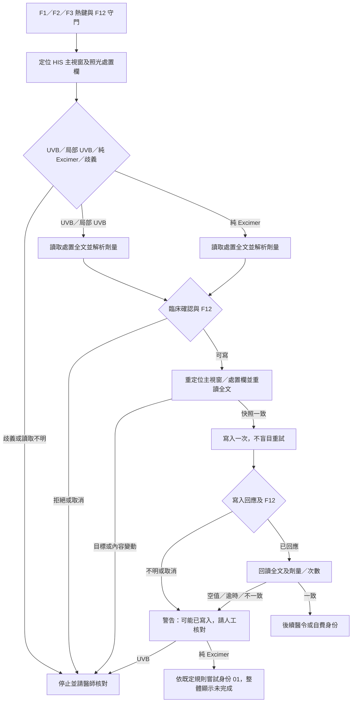

# 第五期：F1–F3 HIS 處置寫入流程與驗收

基準為正式 `main` 的 `7c66bd7aa70d4b0fea50d4aa6f73e3d1cb7564da`。本期只處理可重現的處置寫入狀態問題，使用匿名假 HIS；沒有連線或修改正式病歷。第一至四期已完成的熱鍵註冊、刷新世代、可注入 HIS 介面、排班與會診／打卡邊界均沿用，沒有因 `main.py` 長而重寫整檔。

## 2026-10-01 最新使用者決策

使用者回報純 Excimer 的 F2／F3 因病人資訊列無法確認而停止，一般 UVB 正常，並明確要求「直接刪除病人識別的部分」。這取代下方 2026-09-27 的病人橫幅自動比對方案：照光熱鍵不再讀取或比對病歷號／就診序號；純 Excimer 仍核對原 HIS 主視窗、處置欄 handle、照光類型及寫前全文，保留劑量規則、回讀、取消和部分完成提示。設定身份 01 前後仍核對同一主視窗與純 Excimer 處置欄；目標不明時不寫身份，劑量結果不明而目標可確認時依既定規則嘗試 01 並回報未完整完成。

病人身分由醫師在按熱鍵前人工確認。如果切換病人後 HIS 重用相同視窗、處置欄及相同文字，這些目標檢查不能辨識該切換，不能宣稱仍會自動攔阻。稽核異常時的既有病人定位功能保留，並未刪除；一般日誌與帳本仍不存病史原文。下方關於病人橫幅掃描的描述是前一方案的歷史記錄，不是本次版本的現行行為或驗收要求。

新增兩段使用者提供的無識別 Excimer 格式，各測 F2／F3，確認熱鍵不呼叫病人橫幅採樣而可完成處置及身份流程；既有測試改核對主視窗／處置目標變動、確認時改文及 F12。測試日期調整為有效間隔以隔離本次問題；原紀錄若為當日照光，既有最小間隔檢查仍會停止。匿名測試不代表已完成醫院實機驗收。

## 資料流與狀態

```mermaid
flowchart TD
    A[F1／F2／F3 熱鍵與 F12 守門] --> B[定位 HIS 主視窗及照光處置欄]
    B --> C{UVB／局部 UVB／純 Excimer／歧義}
    C -->|歧義或讀取不明| Z[停止並請醫師核對]
    C -->|UVB／局部 UVB| D[讀取處置全文並解析劑量]
    C -->|純 Excimer| E[讀取處置全文並解析劑量]
    D --> F{臨床確認與 F12}
    E --> F
    F -->|拒絕或取消| Z
    F -->|可寫| G[重定位主視窗／處置欄並重讀全文]
    G -->|目標或內容變動| Z
    G -->|快照一致| H[寫入一次，不盲目重試]
    H --> I{寫入回應及 F12}
    I -->|不明或取消| U[警告：可能已寫入，請人工核對]
    I -->|已回應| J[回讀全文及劑量／次數]
    J -->|空值／逾時／不一致| U
    J -->|一致| K[後續醫令或自費身份]
    U -->|UVB| Z
    U -->|純 Excimer| L[依既定規則嘗試身份 01，整體顯示未完成]
```

| 路徑 | 已驗證成功 | 取消／拒絕 | 寫入或回讀結果不明 |
|---|---|---|---|
| F1 一般／局部 UVB | 確認為一般照光後，依既定順序先輸入 51019＋療程 1，再更新處置；確定無 UVB 行時正常結束 | 分流讀取不明時不輸入任何醫令或療程；後段取消不再當作完整成功，已輸入醫令不自動回退，警告醫師核對 | 已下醫令後才發生的寫入／回讀不明，回傳未完成並提醒醫師核對；不自動重寫或刪醫令 |
| F2／F3 一般／局部 UVB | 先更新並回讀完整處置，再輸入 51019＋療程 2／3 | 停止後續醫令；若寫入後中止，警告可能已有部分結果 | 停止後續醫令，將無法確認的寫入記為 submitted／mismatch，請人工核對 |
| F1 純 Excimer | 保留既定專用醫令 1850159＋療程 1，不自動改身份 | 原有失敗警告及人工處理 | 不套用 F2／F3 身份規則 |
| F2／F3 純 Excimer | 劑量讀回確認且身份 01 也回讀確認後才報完成；略過 51019／療程 | 間隔過短、F12 中止，或寫前快照已變／讀取失敗時不設身份，明確提醒人工核對；醫師拒絕劑量確認、或劑量格式無法更新時，僅在原病人與處置目標仍可確認時依既定計費規則嘗試身份 01，整體報未完成 | 處置已送出但寫入／讀回不明時，僅在原病人與處置目標仍可確認時嘗試身份 01，整體回報未完成；病人或目標無法確認則不設 01，提示人工核對；身份本身未驗證也不報完成 |

劑量、MAX、間隔、一般與局部 UVB 多行更新未變更。使用者於 2026-09-27 選定：**HIS 處置目標或原病人無法確認時，不自動設定純 Excimer 身份 01，由醫師人工核對補正；同一病人與目標仍可確認、但劑量寫入／回讀結果不明時，保留既有的 01 嘗試，整體報未完成。** Excimer 的舊確認流程在按「是」後同時略過陳舊紀錄與上限兩類檢查；這涉及臨床確認次數，本期只記錄為待另行定案的項目，未暗中修改。

| F2／F3 純 Excimer：確認期間 HIS 處置或目標變動 | 實際行為與影響 |
|---|---|
| 原版 | 沒有寫前快照；可能把舊處置全文寫回已變動的目標，隨後設定身份 01。這有覆蓋新病史或錯誤計費目標的風險。 |
| 目前候選版（醫師已定案） | 尋找處置欄之前先讀病人資訊橫幅，分類後及劑量寫入前都核對原病人、主視窗與純 Excimer 處置欄；病人掃描後還會重讀原處置全文，避免掃描期間的編修遭覆蓋。寫前目標變動或讀取失敗即停止，不送出處置寫入也不設身份 01。設定身份之前及回讀後再核對，無法核對或不同即不寫／不報完成，提示人工補正。 |

## 已修反例與限制

舊流程在確認視窗停留時若 HIS 處置被改，可能用舊全文覆蓋新內容；現在寫前重定位視窗和欄位並比對全文，不一致就不寫。舊 UVB 回讀只核對劑量行，其他病史行被 HIS 改掉也可能通過；現在核對完整多行內容及原有劑量／次數規則。Excimer 舊流程只看寫入回應，沒有回讀；現在回讀全文，無法確認不顯示整體完成。純 Excimer 劑量格式無法解析、確認後仍未更新或醫師拒絕確認時，原本可能沒有處置寫入卻回報完成；現在保留既有身份計費動作，但回報未完成，格式無法更新時另顯示警告。F12 在阻塞寫入／回讀期間觸發時，後續醫令或身份不繼續，並顯示可能已有部分寫入。寫入回傳失敗或逾時不再宣稱「未更新」，也不自動重試。

F1 在輸入 51019 之前若有控件類別名稱讀取失敗、列舉失敗、處置欄讀取逾時、主視窗不存在或分流偵測例外，現在會停止並提醒核對；不能將「無法判斷是否為純自費 Excimer」當成一般 UVB。若 F1 前段已輸入 51019，後段卻重新分類成純 Excimer，F12 中止時仍會提醒醫師人工核對：如確認為純自費 Excimer，應處理不相容的 51019 並確認正確的 Excimer 醫令、療程 1、身份及處置；不能將療程 1 一併當成錯誤項目刪除。F12 發生在 UVB 寫入期間或回讀驗證前時，以不含病人識別資訊的 `submitted_unverified` 稽核事件留下可能已寫入的證據。

純 Excimer 的處置文字寫入現在也有獨立的稽核事件：回讀全文確認時記 `ok`，回讀不符記 `mismatch`，寫入或回讀結果不明及 F12 中止記 `submitted_unverified`；身份 01 的既有稽核另行記錄。寫前快照已變而根本未送出處置寫入時，不記成已送出。帳本事件的 `value`／`detail` 只含型別化劑量、次數及原因，不含病史原文或病人識別；身份欄誤定位或回讀不符時，一般日誌也只記原文長度，不記可能誤抓到的姓名或病歷號。`mismatch` 仍依既有告警機制，在動作當下另行採樣病人定位資訊，供告警信及定位索引使用，不寫入帳本事件。這段同步採樣會列舉 HIS 子視窗，診間電腦須確認其延遲與告警收件範圍。

獨立補審另指出：處置已送出但結果不明、劑量已驗證但有部分段落未更新，或醫師拒絕劑量確認等情況，既有純 Excimer 計費規則可能在警告／確認視窗關閉後重新尋找 HIS 主視窗，嘗試設定身份 01；若醫師在這段期間切換病人，舊流程無法證明身份欄仍屬原病人。依 2026-09-27 決策，現在於尋找照光處置欄**之前**保存病人橫幅的白名單定位資訊，並在分類後、純 Excimer 劑量寫入前，以及身份 01 每次寫入嘗試前與回讀後，再核對原病人、主視窗與處置欄；劑量寫入前的病人掃描結束後，也會再次讀取原處置全文。資訊缺失或不同即停止／回報未完成。病歷號只在記憶體內比對，不進一般日誌與稽核帳本。若寫入已嘗試但其後目標變動，或 F12 在身份寫入後才被處理，警語與稽核會標明「結果無法確認」，不宣稱沒有寫入；這兩個原因碼已登錄於稽核帳本，不會降成 `unknown_reason`。首次讀取病人橫幅時按 F12 也會中止流程。院方畫面更新在最後核對與寫入之間仍可能存在競態，且假 HIS 無法證明伺服器實際病人或資料庫結果，仍須實機驗收。

完整文字核對允許 HIS 對**被更新的行**調整標點周圍及數字與單位之間的空白和大小寫，但數字或文字 token 不可拆開（例如 `850` 不可變成 `8 50`，`1.5` 不可變成 `1 . 5`）；原本未改的行須逐行一致。HIS 若刻意新增／移除其他行會被判定為需人工核對。寫前快照只核對主視窗、處置欄 handle、類型與全文，無法在假系統證明真 HIS 患者身份或 Delphi 儲存後資料庫狀態；實機須另驗。處置分類需列舉並讀取相關 edit／memo／rich 控件；其中任一控件讀取不完整就保守停止，故與處置無關的控件逾時、讀取例外或掃描時關閉也可能阻止本次 F1–F3。真實 Win32 讀寫期間的 F12 是阻塞呼叫返回後才由 `check_stop` 處理；假 HIS 可注入中途取消，以驗證保守的結果不明分支。F1 若先分流為一般照光、後來重新分類為 Excimer，警語會提醒 F1 不自動設定身份 01，並要求核對可能已輸入的醫令／療程。HIS 原主視窗若已關閉，警告視窗改用無 owner 顯示；若原 owner 在檢查後才失效，首次顯示失敗會再用無 owner 嘗試一次。

純 Excimer 同一處置若另有遞減或方向不明段落，程式原本會刻意略過該段。完整回讀成功時仍沿用既有「該段未更新、其他段已更新」提示；寫入或回讀結果不明時，警語只說明**程式原本不會調整該段**，並要求人工核對，不宣稱其他段已成功寫入。

`tests/test_main_his_write_transaction_2026_09_25.py` 使用合成 UVB、局部 UVB、Excimer 與非照光病史，涵蓋確認時改文、病人掃描期間改文、主視窗／欄位變更、其他行遺失、回讀空值或不符、I/O 逾時、重複觸發、首次掃描與身份寫入時的 F12、身份結果及原因碼序列化。另以既有 F7／F8／F9／F10／F12、HIS 未知版本、F1–F3 劑量規則及醫令守門測試回歸。所有實測指令與結果以正式 CI 記錄為準。

## 合成耗時

`scripts/benchmark_his_memo_flow.py` 讓基準與候選使用各自常駐、已暖機的 Python 行程，交錯執行 20 對匿名 F2 假 HIS；每次讀取人工睡 2 ms、寫入睡 3 ms。測得中位數（括號為最小–最大）：

| 階段 | 基準 ms | 候選 ms |
|---|---:|---:|
| F2 callback 全程 | 8.3659（7.8471–8.6324） | 11.0131（10.5455–11.3652） |
| HIS 讀取，含候選寫前快照 | 2.2497（2.0983–2.5084） | 4.5273（4.3356–4.8026） |
| 解析／計算 | 0.1520（0.1190–0.1919） | 0.1490（0.1207–0.1851） |
| 寫入 | 3.3491（3.3028–3.5367） | 3.5053（3.0266–3.5181） |
| 回讀 | 2.5045（2.0191–2.6688） | 2.5052（2.0519–2.5132） |

`2026.09.27.1` 候選源碼的重測 JSON 位於工作區外 `C:\Users\User\.codex\artifacts\dermatology-phase5-identity-his-benchmark-20260927.json`。表中數字只屬於該版的**一般 UVB 假 HIS**，不是目前候選版純 Excimer 路徑的測量；後續身份日誌與純 Excimer 寫前再讀處置全文的修改，未包含在表中。該 UVB 案例全程約多 2.65 ms，主要反映一次額外的 2 ms 假處置讀取。病人橫幅在腳本中只由固定匿名 dict 回覆；實際路徑須列舉 HIS 子控件，純 Excimer 還會多次重新核對病人與處置欄、重讀原處置全文。本腳本的假 `locate_phototherapy` 也不模擬掃描，所以 **2.65 ms 不是實機增加耗時的估計或上界**。安全檢查的成本不可為了速度而省略；假熱鍵 callback 也不含真鍵盤鉤子、HIS 網路、Tk 繪製或醫院電腦延遲。20 對樣本不估計實機 p95，診間電腦須另驗新增掃描與處置重讀的延遲。

## 診間電腦待驗與回復

在無病人操作的安全時段，由醫師檢查 F7 浮動門診、F8 快速文字、F9／F10 守門及 F12 中止；於可控測試資料確認 F1、F2、F3 的一般 UVB、局部 UVB、純 Excimer、醫令／療程／身份與全文回讀。純 Excimer 還須確認病人橫幅能穩定提供病歷號，正常同病人時可設定 01，而切換病人、處置欄變更或橫幅讀取失敗時能停止自動設定並提示人工核對。尤其注意 HIS 因寫入觸發的自動格式化會否使完整文字核對持續報警；未知 HIS 版本仍只通知並保守處理。記錄不含姓名、病歷號或病史全文的版本、步驟和結果，不為量測增加真病歷寫入。

若實機不相容，回退整個已驗證的前版 `7c66bd7aa70d4b0fea50d4aa6f73e3d1cb7564da` 對應發布包與 `manifest.json`，保留設定與資料；不要只複製單一 `main.py`，避免版本與雜湊不一致。對已寫入但無法確認的個案，先人工核對 HIS，勿重按熱鍵當作回退。
